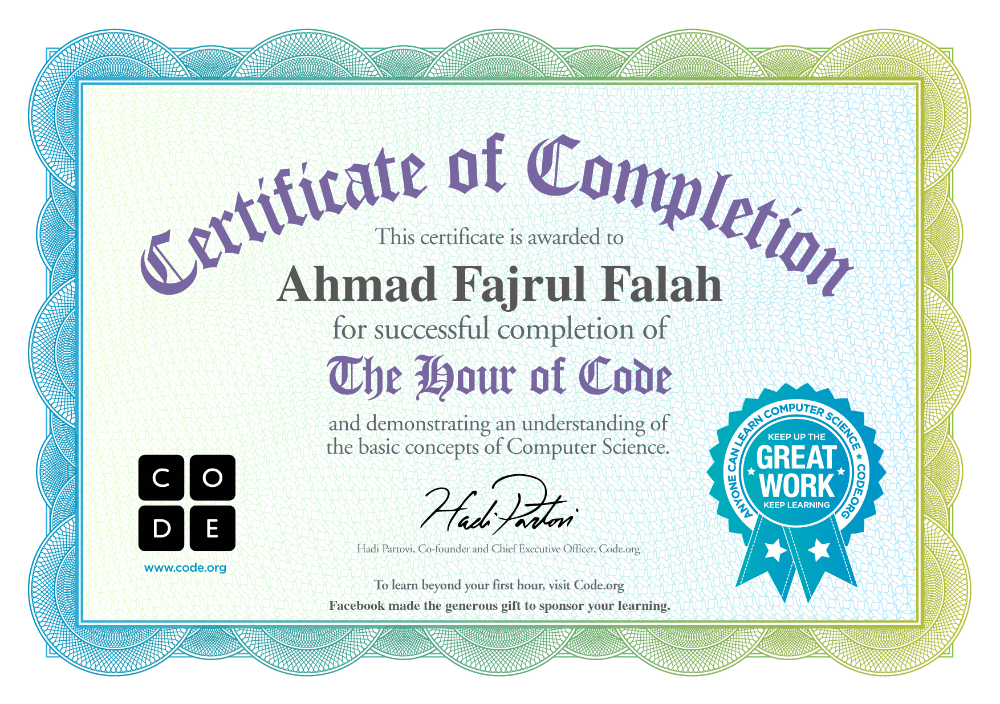

# Learn Markdown

# h1

>```
> # h1
> ```

## h2

>```
> ## h2
> ```

### h3
----

>```
> ### h3
> ```

* text
* text 2
   * sub text

>```
>* text
>* text
>   * sub text
>```

*textitalic* or _textitalic_

>```
> *textitalic* or _textitalic_
>```

**Bold** or __bold__

>```
> **Bold** or __bold__
>```

~~strikethrough text~~

>```
> ~~strikethrough text~~
>```

## Link

[Github](http://github.com/linxcodev)

[Google](http://www.google.com)

>```
> [Alt](Your_link)
>```

[Goes to folder](image)

>```
> [Alt](Your_folder)
>```

## Image

>```
>
>```



## Script

```
 script
```

code :

````
*````
 script
*````
````
nb : delete (*)

## Quote

> Block Qoute

Code :

````
> Block Qoute
````

## Script php

>```php
> public static news()
> {
>    return $book;
> }
>```

Code :

```
*```php
public static news()
{
  return $book;
}
*```
```

## Script Html

>```html
> <h1>Title<h1>
>```
code :

```
*```html
<h1>Title<h1>
*```
```

Change script `h1` to script `h2`

````
Change script `h1` to script `h2`
````

## create table

|no|nama|umur|
|--|----|----|
|1|fajrul|21|

code :

````
|no|nama|umur|
|--|----|----|
|1|fajrul|21|
````
